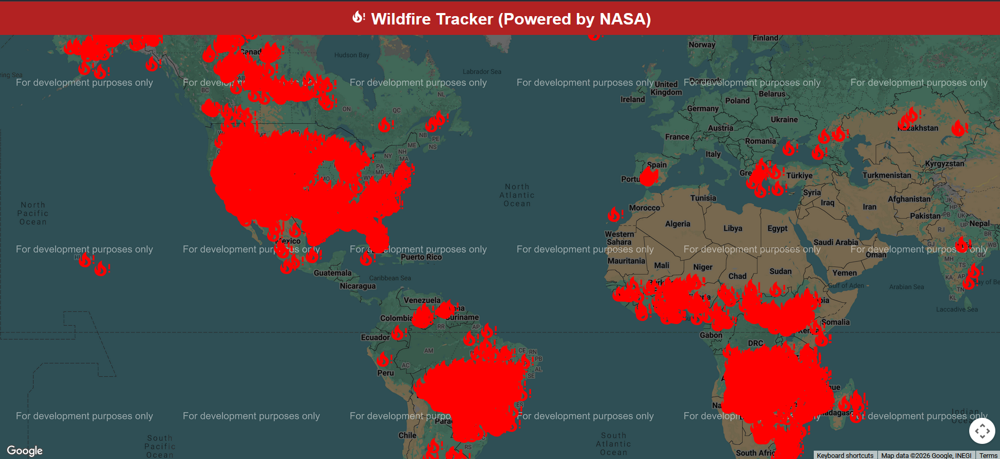
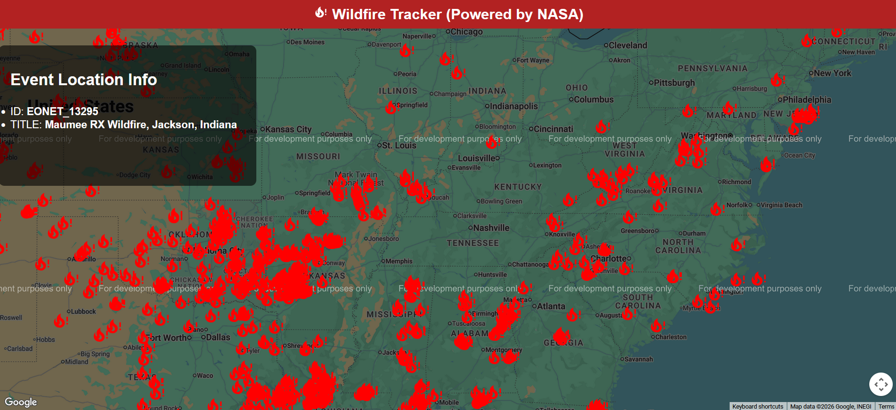

# Wildfire Tracker

An interactive web application that displays **real-time wildfire events**
using data from the **NASA EONET API**, visualized on an interactive map.

This project allows users to explore active wildfires, view their locations,
and access detailed event information directly on the map.

---

## Preview





---

##  Features
-  Interactive map displaying wildfire locations
-  Real-time wildfire data from NASA (EONET API)
-  Clickable markers with detailed event information
-  Loading indicator while data is being fetched
-  Responsive and user-friendly interface

---

##  Tech Stack
- **Frontend:** React
- **APIs:** NASA EONET API, Google Maps API
- **Languages:** JavaScript, HTML, CSS
- **Tools:** Git, GitHub

---

## Installation & Setup

### Clone the repository
```bash
git clone https://github.com/marcosvfigueiroa/wildfire-tracker.git
cd wildfire-tracker
```

- Create a file named key.env in the project root and add:
```bash
  REACT_APP_GOOGLE_MAPS_API_KEY=your_api_key_here
```
- Install dependencies
```bash
npm install
```

- Run the application
```bash
  npm start
```

- The app will be available at: http://localhost:3000

## Author

**Marcos Figueirôa**

- IT student in *Techniques de l’informatique* at Cégep de Valleyfield  
- Québec, Canada  
- Interested in software development, APIs, and databases  

🔗 **GitHub:** https://github.com/marcosvfigueiroa  
🔗 **LinkedIn:** https://www.linkedin.com/in/marcos-figueiroa


